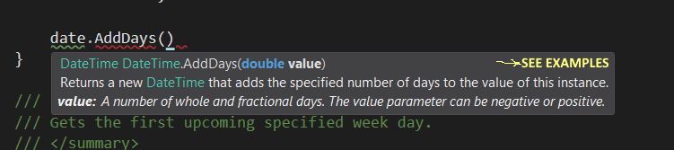

# Background
When writing code, developers need to discover APIs as they go. But often they don't use the official MSDN documentation because:

- The definitions can be written in a complex language.
- Examples are rarely there, and can be unnecessarily long. You have to read a lot of code to see the actual point.
- The examples don't show all the different scenarios of using the method.

# .NET API Matrix
This is a new concept for learning APIs. The philosophy behind it is that *what developers are really interested in* when looking through methods in the .NET API is **clear examples** of all the **differnt scenarios for using it**. That's one's mind often works:

- What are typical, happy scenarios?
- What happens in edge case A?
- What happens in edge case B?
- ...

> This project will provide documentation exactly in that format. It's basically a list of scenarios for using each API element (method, property, etc) driven by examples.

# Visual Studio Integration
A VS extension (work in progress) will **bring up this content** right **where you need it**. It will be integrated with the normal Intellisense in Visual Studio and open a pop-up to show the content right there and then.



Which will then show you [this in a pop-up window](System/DateTime/AddDays.md)

# Want to contribute?
If you want to contribute to this project please use the following rules.
It's recommended that you install this Visual Studio Extension used for [editing markdown files](https://marketplace.visualstudio.com/items?itemName=MadsKristensen.MarkdownEditor).

### Path Structure
For each method or property, it provides one MD file with all the information you need to use it:
They can be looked up right inside Visual Studio using the Cheat Visual Studio extension when using each method.

Each method, property or event, should be created as a .MD file with the following exact path:
{Namespace}/{Class}/{Member}.md

For example the Append() method of the StringBuilder class will be documented here:
> System/Text/StringBuilder/Append.md

### Content template
```
*Namespace: **{Namespace}***
# {ClassName}.{MethodName}(*params*) ➜ *returns {ReturnValue}*
{Description}
## Remarks
- {Tip 1}
- {Tip 2}
- ...

## Examples

|Object|Call|Result|Remarks|
|---|---|---|---|
| ...  | .{MethodName}({param})  | ➜ {Result} | {Example notes (optional)}
| ...  | .{MethodName}({param})  | ➜ {Result} | {Example notes (optional)}

[More details](https://docs.microsoft.com/en-us/dotnet/api/{namespace}.{class}.{member})
```

### Editing guidelines
- The top description should be focused on the high level reason why that thing exists. That helps the learner to quickly grasp what this member is, without worrying about the details of HOW it's implemented.
- All further details about how it's implemented, or tips should go under Remarks.
- Under *examples*, make sure you include edge cases. Often a learner needs to know how the method handles special cases such as null, zero, negative value, etc. This will help them to avoid writing unnecessary validation logic in their code if the target method can already handle it nicely.
- Give as much attention to the examples as possible. That's the main way the learner will use to understand the method. Use easy to follow and simple examples.

### Sources
- Microsoft currently has two websites for .NET API documentation. For example for DateTime.AddDays() method there is [this](https://docs.microsoft.com/en-us/dotnet/api/system.datetime.adddays?view=netframework-4.7.1) and [this](https://msdn.microsoft.com/en-us/library/ee424859.aspx).
- Each one of the above sources can have different content, different wording, examples or details to explain the API.
- You should check out both of them in producing the content for this website, to ensure all useful information is transferred.
**Do not blindly copy and paste. You should change the format based on:**:
- Simplify the wording, so they are down-to-earth and quicker to grasp.
- For every tip, remark, condition or exception, demonstrate that with an example and move the remarks to the row of that example.
- If it's not possible or simple to show a remark or tip with an example, only then add a textual remark for that. But always favour examples to convey the knowledge.
