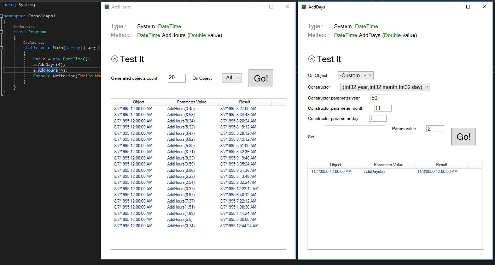

# Matrix

Matrix is a Visual Studio extension that helps developers get to know more about .NET APIs.

## Background

When writing code, developers need to discover APIs as they go. But often they don't use the official MSDN documentation because:

- The definitions can be written in a complex language.
- Examples are rarely there, and can be unnecessarily long. You have to read a lot of code to see the actual point.
- The examples don't show all the different scenarios of using the method.

### .NET API Matrix

This is a new concept for learning APIs. The philosophy behind it is that *what developers are really interested in* when looking through methods in the .NET API is **clear examples** of all the **different scenarios for using it**. That's one's mind often works:

- What are typical, happy scenarios?
- What happens in edge case A?
- What happens in edge case B?
- ...

> This project will provide documentation exactly in that format. It's basically a list of scenarios for using each API element (method, property, etc) driven by examples.

### Visual Studio Integration

A VS extension (work in progress) will **bring up this content** right **where you need it**. It will be integrated with the normal Intellisense in Visual Studio and open a pop-up to show the content right there and then.

Which will then show you this in a pop-up window

## Contribute

As this is a community open source project, all kind of contributions are welcome.

### Why contribute

- Deepen and improve your own knowledge of the .NET framework.
- Improve the lives of the the global .NET community and make their lives easier.
- Indirectly improve the quality of software applications across the world.
- Geeks Ltd, a software development company in London, UK, is proud to sponsor this project. We can compensate you for your time.

## Metrics
 

